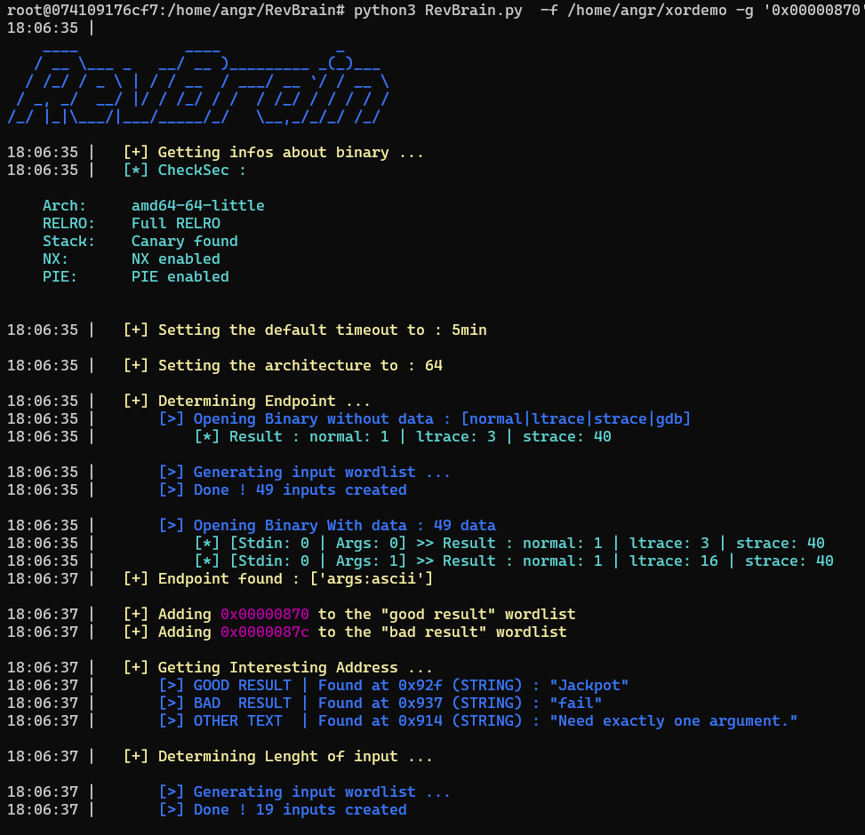

# RevBrain
This tool automates the recognition phase of a crackme binary &amp; try to solve it . Mainly useful for basic reverse CTFs challenges !




### Classic Installation :
```bash
git clone https://github.com/Vozec/RevBrain.git
cd RevBrain
chmod +x setup.sh
./setup.sh
```

### Docker Installation :
```bash
docker build -t angr .
docker run -it --name angr -v "c:/Users/$($env:UserName)/Desktop:/home/angr" angr
```
*(Change the shared folder path)*
Shortcut for ``Windows Terminal App`` : 

```Bash
%SystemRoot%\System32\WindowsPowerShell\v1.0\powershell.exe -Command "$prog=\"C:\Program Files\Docker\Docker\Docker Desktop.exe\";if (! (ps | ? {$_.path -eq $prog})) {& $prog;Start-Sleep -Seconds 15};docker run -it -v \"c:/Users/$($env:UserName)/Desktop:/home/angr\" angr"
```

### Usage : 

```bash
usage: RevBrain.py [-h] -f FILE [-w FORMATFLAG] [-g WIN_WORD] [-b FAIL_WORD] [-a {32,64}] [-i TYPE_INPUT] [-t TIMEOUT]

This tool automates the recognition phase & solve a crackme binary. Mainly useful for CTFs

options:
  -h, --help     show this help message and exit
  -f FILE        Path of the binary
  -w FORMATFLAG  Format Flag (default= 'flag{}' )
  -g WIN_WORD    Valid string/address result (ex: 'Here is the flag' ) | ex: -g "you win" or -g "['win','0x00000835']"
  -b FAIL_WORD   Fail string/address result (ex: 'Invalid Password' ) | ex: -g "failed " or -g "['nop','invalid',0x00000872]"
  -a {32,64}     Type of architecture
  -i TYPE_INPUT  Type of Input: (ex: ['stdin:digit','args:ascii','args:ascii'])
  -t TIMEOUT     Set Timeout (minutes) (default=5min)
```

The tool determines by itself all the information but the arguments are necessary for a better precision

### Example : 

```bash
python3 RevBrain.py  -f /home/angr/xordemo -g '0x00000870' -b '0x0000087c' -a 64
python3 RevBrain.py  -f /home/angr/crackme -i ['stdin:digit'] -w 'ctf{'
```

### Result : 


https://user-images.githubusercontent.com/61807609/170552097-82751268-0af0-47ee-91cc-7788cf68bc58.mp4


